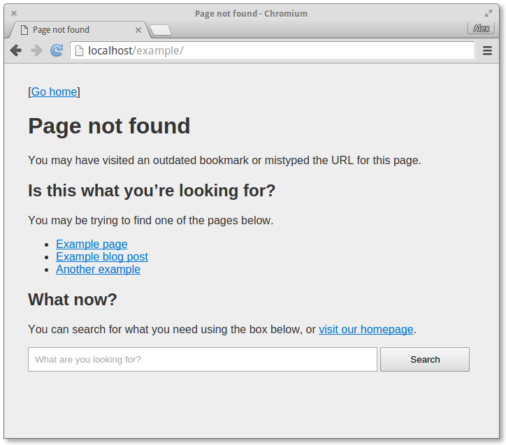
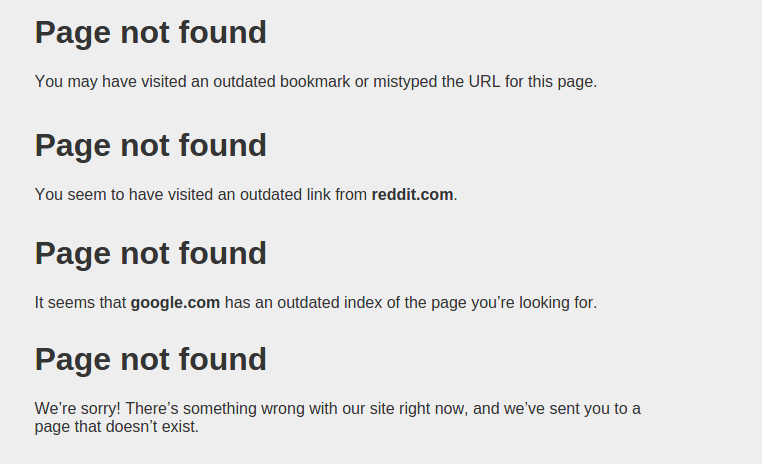

Wagtail Error Pages
===================
Pretty, smart, customizable error pages for Wagtail. It was inspired by A List Apart's article on [The Perfect 404](http://alistapart.com/article/perfect404).

#### Features:
* Simple language (no jargon)
* Search box
* Suggests pages by searching the URL
* Adjusts message depending on where the user came from
* Customizable

Search
------
The 404 page tries to suggest pages the user may be looking for based on the URL entered. If the user doesn't find what they're looking for, they are encouraged to search or visit the home page.

Messages
--------
Depending on where the user came from, the 404 message will adjust. It determines this based on the `document.referrer` property in JavaScript. If JavaScript is turned off, a generic message will be displayed instead.

Here are the possible messages for **empty referrer**, **external referrer**, **external referrer (search engine)**, and **internal referrer** respectively.

Install
-------

    pip install wagtailerrorpages

Then add `wagtailerrorpages` to your installed apps.

Usage
-----
If you don't have a `404.html` or `500.html` in the root of your templates directory, they will be pulled automatically from this app.

#### 404 Page
To override and style the 404 page, create a `404.html` in the root of your templates directory, and add the following code to the top:

    

Then, add template blocks to override features of this template. See the section below ("Extending the base404 template") for a full reference, or refer to `404base.html` inside of this repo.

#### 500 page
You can't configure the 500 page. This is by design; if there is a server error, it's possible that Wagtail will not be capable of rendering template tags, so it's best to keep this template self-contained and static.

If you'd like to make a custom one, copy the one from this app into `templates/500.html` on your app and edit it directly.

#### Testing
If you used [cookiecutter-wagtail](https://github.com/torchbox/cookiecutter-wagtail), you can visit `/test404` and `/test500` on your site in debug mode to preview the templates. If not, you can [configure your urls.py](https://github.com/torchbox/cookiecutter-wagtail/blob/23d5dd7a7ba1e442f6c8c5526d211900d05030ef/%7B%7Bcookiecutter.repo_name%7D%7D/%7B%7Bcookiecutter.repo_name%7D%7D/urls.py#L23) to allow this.

Using your own layout
---------------------
If you just want the 404 page content (message and search box), you can drop it anywhere with:

    
    

This might be useful if you'd prefer to keep the 404 page inside of your site's base layout.

Custom search behavior
----------------------
If you'd like to override how the suggestions are shown, import the 404 message in your template like this:

    

Then do the search in Python and render the pages list appropriately.

Extending the base404 template
------------------------------
If you extend the base404 template with:

    

You have the ability to override parts of the page. The following is a reference for the layout's overridable template blocks.

#### Document title
Override the page title in the browser tab. It's a good idea to add the website's name at the end.

    Page not found - MySite

#### HTML meta tags
Override meta tags in the HTML head. Below is the default.

    
      <meta charset="utf-8">
      <meta http-equiv="X-UA-Compatible" content="IE=edge">
      <meta name="viewport" content="width=device-width, initial-scale=1">
    

#### Stylesheet and extra HTML head
Extra head content; put your custom stylesheet here. By default it contains the custom stylesheet, so overriding this block will remove it.

    
      <link rel="stylesheet" href="">
    

#### Page header
The top part of the page body. By default this contains the "Go home" link. You may want to include the website's logo, but avoid including a full navigation.

    
      [<a href="/">Go home</a>]
    

#### Page content
It's advised that you don't override this without a good reason. It imports the 404 message fragment.

    
      
    

#### Page footer
The bottom part of the page body. You may want to include useful links for a lost user, or legal/copyright information.

    
